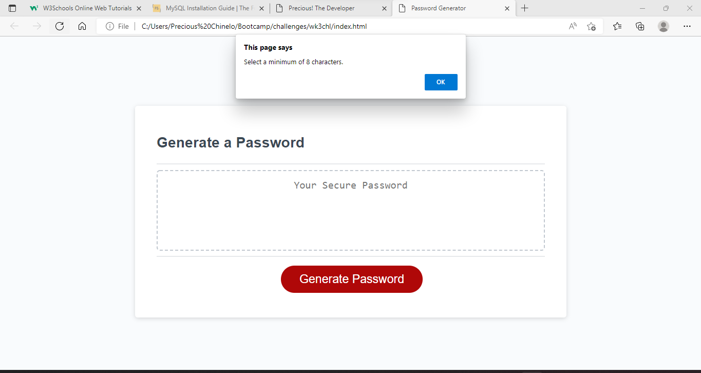
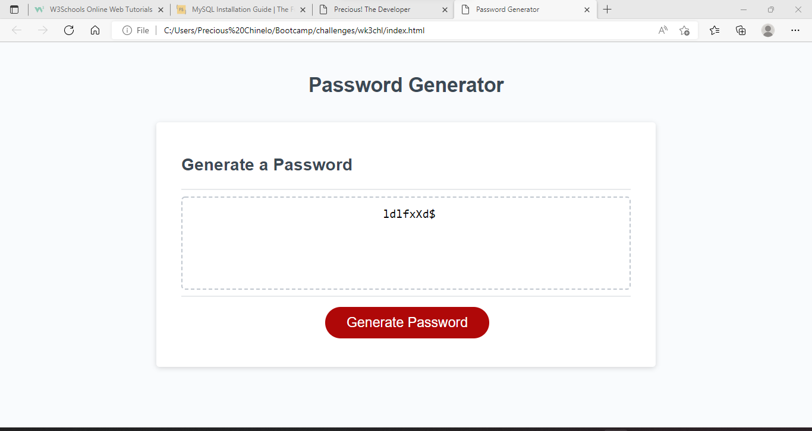

# <Password Generator>

---

## Description

My motivation to fix this code was to utilize the geneator for future purposes as it is actually handy. I built this project because it could solve the problem of having to come up with a unique password when it comes time to change my password to an account. I learned that drying out a code, is not necessarily breaking the code!

---
## User Story

AS AN employee with access to sensitive data
I WANT to randomly generate a password that meets certain criteria
SO THAT I can create a strong password that provides greater security

---

## Installation

There are no installtion guide, persay. The user just needs to follow the prompts, pick at least 2 of the 4 items, and enjoy their new password. 

---

## Usage
In order to get your new password, first select how many characters you would like. You can pick a number from 8-128 characters for your new password. If you select a number that is less than 8, or greater than 128, you will get an alert advising you to reconsider your selection.

    

After you have gone through the prompts to chose your style of password, your new password will be generated in the box displayed. Enjoy!

